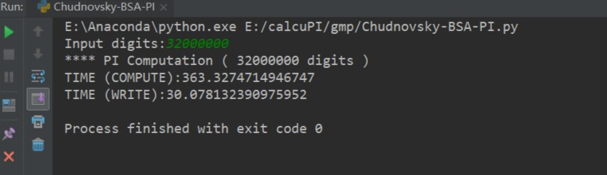

# 写在之前

------
  先上链接，以示尊重
`https://www.mk-mode.com/octopress/2015/05/06/cpp-pi-computation-by-chudnovsky-bsa-with-gmp/`  
这是日本的一位大牛的博客。本片文章所有算法和灵感均来自这篇博客。版权归这个作者所有。  

# Chudnovsky计算圆周率

------
  Chudnovsky(丘德诺夫斯基)方法是计算PI非常快速并且精度很高的方
法。普通的计算PI的方法，比如级数发，收敛满并且精度低。马青公式计算速度过慢。  
  利用Chudnovsky(丘德诺夫斯基)方法，快速计算圆周率。本方法基于
BSA(二进制分裂算法)用于减少串联扩展的计算量(计算时间)  
  本次实验是将这个算法用python实现，因为python也有类似于gmp的包
(gmpy2)，所以实现起来还是比较方便  

# 最终计算三千两百万位圆周率的结果

环境是Intel i7-4720HQ
