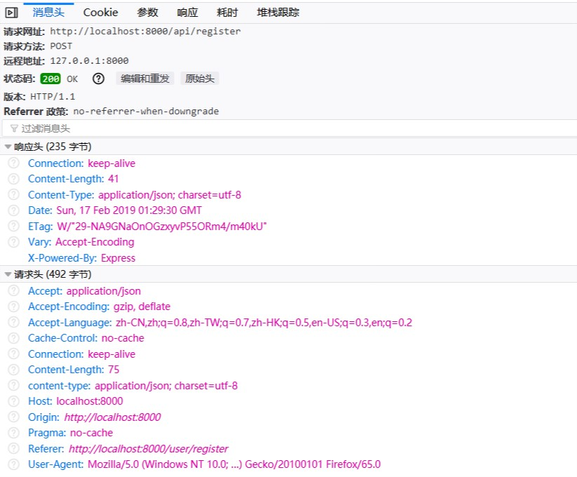
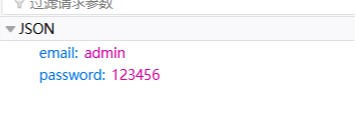
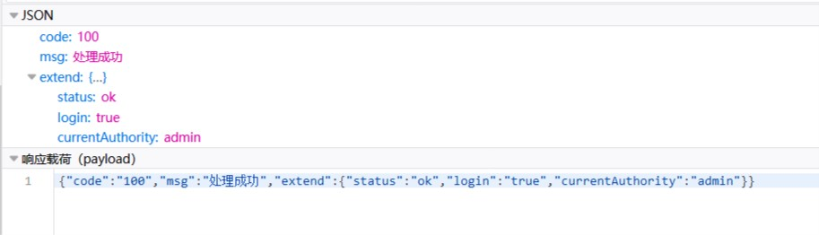

# Ant Design Pro于后端相连
----
## 原理
AntdPro前后端交互是用request，response来实现的。 
举例来说，用户登录时js文件是`src/pages/User/Login.js`，  
这个js文件有个handleSubmit函数
```js
handleSubmit = (err, values) => {
    const { type } = this.state;
    if (!err) {
      const { dispatch } = this.props;
      dispatch({
        type: 'login/login',
        payload: {
          ...values,
          // type,
        },
      });
    }
  };
``` 
这个函数的用到的知识应该是Redux。注意类前面的@connect
```js
@connect(({ login, loading }) => ({
  login,
  submitting: loading.effects['login/login'],
}))
```
连接到`src/models/login.js`这个文件，这个文件的effects下面的函数就是前后端交互的主要内容了。  
主要就是这一行`const response = yield call(fakeAccountLogin, payload);`  

## 至于怎么交互  
---

观察Pro给出的`@/utils/request.js`文件，值得注意的是，前端request的body不是键值对，而是json文件，json文件内是才是属性的键值对。
这是request的消息头  
  

这是request的参数，是json  
  

这是response相应，返回的看后端是怎样打包的了，在Pro的mock里，返回的也是json  
  

至于Pro的mock，就是模拟了后端的操作，例如用户登录的mock，在`mock/user.js`
```js
'POST /api/login/account': (req, res) => {
    const { password, email } = req.body;
    if (password === '123456' && email === 'admin') {
      res.json({
        code:'100',
        msg:'处理成功',
        extend:{
          status: 'ok',
          login: 'true',
          // type,
          currentAuthority: 'admin',
        },
      });
      return;
    }
    if (password === '123456' && email === 'user') {
      res.send({
        status: 'ok',
        type,
        currentAuthority: 'user',
      });
      return;
    }
    res.send({
      status: 'error',
      type,
      currentAuthority: 'guest',
    });
  },
```
从req.body得到参数，然后做判断，最后返回json。  
等到真正与服务器相连的时候，  
根据后端返回的json，修改`src/models/login.js`这个文件接收后的参数  
根据后端需要的参数，修改`src/pages/User/Login.js`这个文件发送请求的参数  
由此可以做到前后端结合。

## 关于怎样代理到后端 
---

可以根据Pro官网推荐的，利用nginx做请求转发。
```shell
location /api/login/account {
	proxy_pass http://后端ip:端口;
}
```
